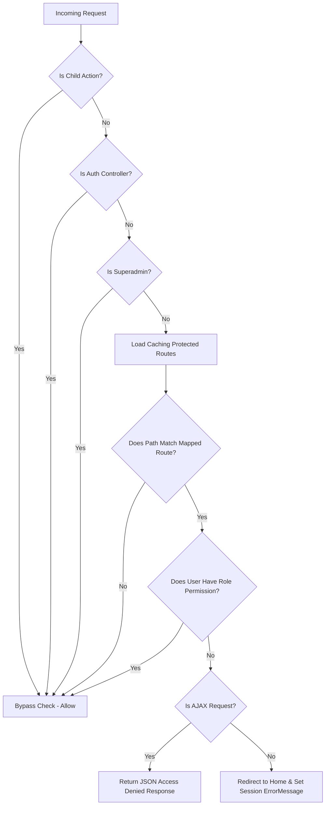

# Permissions & URL Authorization System 🔒

Zentora HRMS utilizes a robust, automated, and high-performance **Role-Based Access Control (RBAC)** filter to authorize page requests, API endpoints, and database mutations.

---

## 🛠️ Key Components

The security mechanism consists of two primary C# classes and a layout view:

1.  **[PermissionManager.cs](file:///C:/digvijayProjects/Projects/zentora/zentoraHRMS/Helpers/PermissionManager.cs)**: Interface for querying and caching route-based permissions from the database.
2.  **[PermissionActionFilter.cs](file:///C:/digvijayProjects/Projects/zentora/zentoraHRMS/Filters/PermissionActionFilter.cs)**: Global action filter that intercepts incoming HTTP requests to evaluate authorization.
3.  **[_Layout.cshtml](file:///C:/digvijayProjects/Projects/zentora/zentoraHRMS/Views/Shared/_Layout.cshtml)**: App layout that captures unauthorized redirection warnings and renders toast alerts.

---

## 🔄 Lifecycle of a Request

Below is the workflow for every request intercepted by the authorization system:



---

## ⚙️ How It Works

### 1. High-Performance Caching
To prevent querying SQL Server on every single HTTP request, `PermissionManager.GetProtectedRoutes()` caches the set of all mapped routes in memory:
```csharp
private static HashSet<string> _protectedRoutes;
private static readonly object _lock = new object();

public static HashSet<string> GetProtectedRoutes() {
    if (_protectedRoutes == null) {
        lock (_lock) {
            if (_protectedRoutes == null) {
                // Queries routes from ParentModules, ChildModules, and SubChildModules
                _protectedRoutes = LoadFromDatabase();
            }
        }
    }
    return _protectedRoutes;
}
```

### 2. Request-to-Route Mapping (`GetMatchingModuleRoute`)
Helper endpoints (like `/Staff/SaveEmployee`) do not correspond directly to main view routes (like `/Staff/Employees`). The filter maps action endpoints to their parent module route using segment inspection:
*   Matches `/Staff/SaveEmployee` $\rightarrow$ `/Staff/Employees` (requires `"add"` action permission).
*   Matches `/Staff/DeleteUser` $\rightarrow$ `/Staff/Users` (requires `"delete"` action permission).

### 3. Action Mapping (`GetRequiredAction`)
Maps action name keywords to action verbs:
*   `Save...`, `Create...`, `Add...` $\rightarrow$ **`add`**
*   `Update...`, `Edit...`, `Modify...` $\rightarrow$ **`edit`**
*   `Delete...`, `Remove...` $\rightarrow$ **`delete`**
*   Other actions (Index, Get, lists) $\rightarrow$ **`view`**

### 4. Direct vs. AJAX Interception
*   **Direct Page Navigation:** Sets `Session["ErrorMessage"] = "Access Denied..."` and redirects to `/Home/Index`.
*   **AJAX Requests:** Intercepted and responded to with JSON to keep the frontend operational:
    ```json
    { "success": false, "message": "Access Denied: You do not have permission to perform this action." }
    ```

---

## 🔔 Displaying Unauthorized Notifications

If a direct page redirect is triggered, `_Layout.cshtml` renders a warning toast and clears the session:

```html
@if (Session["ErrorMessage"] != null)
{
    <script>
        $(document).ready(function () {
            toastr.error("@Session["ErrorMessage"]");
        });
    </script>
    Session["ErrorMessage"] = null; // Clear key
}
```
